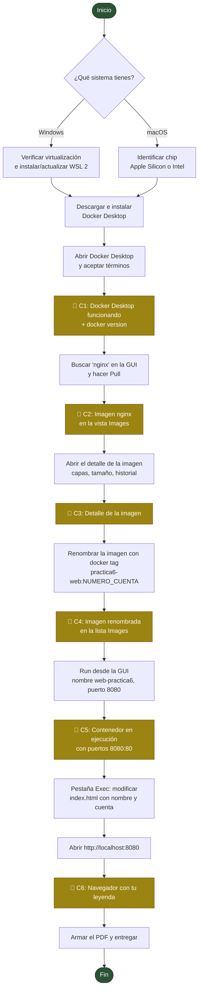
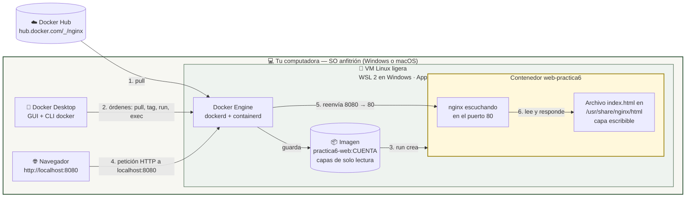
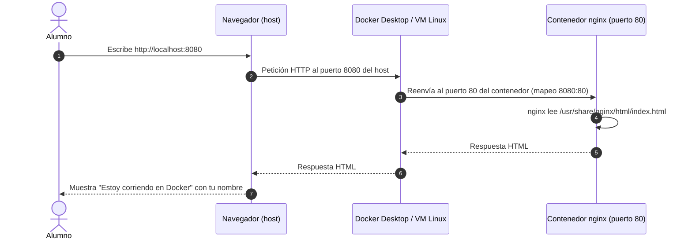

# Práctica 6 · Docker GUI (Docker Desktop)

**Universidad Autónoma del Estado de México (UAEMEX)**
Unidad: Virtualización y contenedores · Modalidad: individual · Entregable: **1 PDF con 6 capturas**

---

## 🎯 Objetivo

Instalar **Docker Desktop** en tu computadora y, usando principalmente su interfaz gráfica (GUI):

1. Descargar la imagen oficial del servidor web **nginx**.
2. Inspeccionar la imagen (capas, tamaño, historial).
3. Crear una copia de la imagen con **un nombre nuevo** que incluya tu número de cuenta.
4. Lanzar un **contenedor** a partir de esa imagen y abrirlo en el navegador.
5. Modificar la página HTML **dentro del contenedor** para que muestre tu nombre y número de cuenta.
6. Documentar el proceso con capturas y entregar un **PDF**.

> ⏱️ Tiempo estimado: 45–60 minutos (la instalación es lo que más tarda).

---

## 📂 ¿Qué guía debo seguir?

| Tu sistema operativo | Guía paso a paso |
|---|---|
| 🪟 **Windows 11 / Windows 10** (la mayoría del grupo) | [`Practica6_Windows.md`](./Practica6_Windows.md) |
| 🍎 **macOS** (Apple Silicon M1–M4 o Intel) | [`Practica6_macOS.md`](./Practica6_macOS.md) |

Ambas guías tienen **los mismos pasos y las mismas 6 capturas**; solo cambian la instalación y algunos atajos de teclado.

**Imagen que usaremos:** nginx (imagen oficial) → <https://hub.docker.com/_/nginx>

---

## 🗺️ Mapa completo de la práctica

Las capturas de pantalla 📸 indican los momentos exactos en los que debes tomar captura.



---

## 🔌 ¿Cómo se conecta un contenedor con tu sistema operativo?

Un contenedor **no es una máquina virtual completa**: comparte el *kernel* (núcleo) de Linux con el sistema que lo ejecuta. Como Windows y macOS no son Linux, Docker Desktop crea una **máquina virtual Linux ligera** y ahí corre el motor de Docker. Tu navegador llega al contenedor gracias al **mapeo de puertos**.



### La misma idea, como secuencia de una petición web



---

## 📖 Conceptos clave (vocabulario mínimo)

| Concepto | En una frase |
|---|---|
| **Imagen** | Plantilla de solo lectura con todo lo necesario para ejecutar un programa (aquí: nginx + Linux mínimo). |
| **Contenedor** | Una instancia en ejecución de una imagen. Tiene su propia capa escribible encima de la imagen. |
| **Tag (etiqueta)** | El nombre `repositorio:versión` de una imagen, por ejemplo `nginx:latest`. «Renombrar» una imagen = crearle otro tag que apunta al mismo contenido. |
| **Registro** | Almacén de imágenes en internet. El público más usado es Docker Hub. |
| **Mapeo de puertos** | Regla `host:contenedor` (ej. `8080:80`) que conecta un puerto de tu computadora con uno del contenedor. |
| **Exec** | Abrir una terminal *dentro* de un contenedor que ya está corriendo. |

> ⚠️ **Importante:** el cambio que harás al `index.html` vive en la **capa escribible del contenedor**, no en la imagen. Si borras el contenedor, el cambio se pierde; la imagen sigue intacta. Es justo lo que queremos que observes.

---

## 📸 Resumen de capturas (las mismas en Windows y macOS)

| # | Momento | Qué debe verse |
|---|---|---|
| **C1** | Docker instalado | Docker Desktop abierto con el motor en ejecución y una terminal mostrando `docker version` |
| **C2** | Imagen descargada | Vista **Images** con `nginx` `latest` en la lista |
| **C3** | Imagen inspeccionada | Detalle de la imagen nginx (capas / historial / tamaño) |
| **C4** | Imagen renombrada | Lista **Images** con `practica6-web:<tu_cuenta>` y el comando `docker tag` visible |
| **C5** | Contenedor en ejecución | Vista **Containers** con `web-practica6` en verde y puertos `8080:80` |
| **C6** | Resultado final | Navegador en `localhost:8080` mostrando tu nombre y número de cuenta |

## 📄 Entregable

Un solo archivo PDF llamado:

```
P6_DockerGUI_<ApellidoPaterno>_<NumeroDeCuenta>.pdf
```

Estructura sugerida (3–4 páginas):

1. **Portada:** UAEMEX, unidad de aprendizaje, «Práctica 6 · Docker GUI», nombre completo, número de cuenta, sistema operativo usado, fecha.
2. **Capturas C1 a C6**, cada una con un pie de foto de una línea que explique qué se ve.
3. **Conclusión** (3 a 5 líneas): ¿qué diferencia observaste entre imagen y contenedor? ¿Qué pasaría con tu cambio al HTML si eliminas el contenedor?

Puedes armarlo en Word, Google Docs o Pages y exportar a PDF.

---

## 🗂️ Estructura del repositorio

```
.
├── README.md               ← este archivo (visión general + diagramas)
├── Practica6_Windows.md    ← guía detallada para Windows
└── Practica6_macOS.md      ← guía detallada para macOS
```

## 🔗 Enlaces oficiales

- Docker Desktop (página del producto): <https://www.docker.com/products/docker-desktop/>
- Instalación en Windows: <https://docs.docker.com/desktop/setup/install/windows-install/>
- Instalación en macOS: <https://docs.docker.com/desktop/setup/install/mac-install/>
- Vista *Images* de Docker Desktop: <https://docs.docker.com/desktop/use-desktop/images/>
- Imagen oficial de nginx: <https://hub.docker.com/_/nginx>

> Docker Desktop es gratuito para uso personal y **educativo**, de acuerdo con los términos de suscripción de Docker.

> 🔔 **Esta práctica es la base de las siguientes prácticas del curso: no desinstales Docker Desktop al terminar.**
