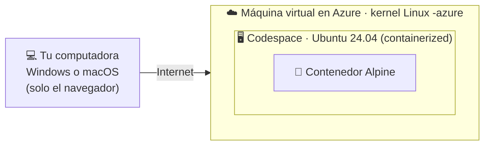

# Práctica «Un archivo, tres mundos» · Variante **GitHub Codespaces**

> Para quienes no pueden usar Docker Desktop en su computadora. Solo necesitas un navegador y tu cuenta de GitHub **con el correo verificado** (ver [`CUENTA_GITHUB.md`](CUENTA_GITHUB.md)).
> Duración: **60 minutos**. Costo: **ninguno**.

**Antes de empezar, verifica:**

- [ ] Puedes iniciar sesión en https://github.com y tu correo está verificado.
- [ ] Tienes a la mano tu número de cuenta.
- [ ] Tienes tu hoja para responder (`HOJA_DE_RESPUESTAS_CODESPACES.md`).

**Tres marcas que verás en toda la guía:**

| Marca | Dónde escribes | El inicio de línea se ve como… |
|---|---|---|
| 💻 **TU COMPUTADORA** | Solo el navegador (y una prueba opcional en la sección 7) | — |
| 🖥️ **CODESPACE** | La terminal de VS Code en el navegador | `@usuario ➜ /workspaces/practica-docker-codespaces (main) $` |
| 🐧 **CONTENEDOR** | Dentro de Linux Alpine | `/practica #` |

---

## Sección 0 · Preparar el codespace (5 min) 💻

**¿Para qué?** Un **codespace** es una computadora Linux en la nube de GitHub que manejas desde el navegador. Será tu **anfitrión**: el lugar donde corre Docker.

1. Entra a https://github.com/new para crear un repositorio:
   - **Repository name:** `practica-docker-codespaces`
   - Elige **Private**.
   - Marca **Add a README file**.
   - Clic en **Create repository**.
2. En tu repositorio, haz clic en el botón verde **Code** › pestaña **Codespaces** › **Create codespace on main**.
3. Espera a que se abra **VS Code en el navegador** (unos 2 minutos).
4. Si no ves la terminal abajo, ábrela con el menú **☰ › Terminal › New Terminal**.

> **Si cierras la pestaña** o el codespace se detiene por inactividad (30 minutos sin usarlo), **tus archivos no se pierden**. Vuelve a abrirlo desde https://github.com/codespaces y repite los pasos 1.2, 1.3 y 1.4.
>
> Cerrar la pestaña **no apaga** el codespace: sigue consumiendo tu cuota hasta 30 minutos. Al terminar la práctica lo detendrás y eliminarás a mano (sección 7.6).

---

## Sección 1 · Identidad, carpeta de proyecto y bitácora (7 min) 🖥️

**¿Para qué?** Todo trabajo de administración debe dejar rastro de *quién* lo hizo, *en qué equipo* y *cuándo*. Y un buen procedimiento debe funcionar en cualquier equipo sin escribir rutas a mano.

### 1.2 Bloque de preparación de la sesión

```bash
BASE="${CODESPACE_VSCODE_FOLDER:-$PWD}"
PROYECTO="$BASE/practica-docker-sistemas-archivos"
IMAGEN="alpine:3.21"
echo "Tu carpeta de trabajo es: $BASE"
```

> **¿Por qué no usamos el Escritorio?** En la nube **no hay escritorio gráfico**: la carpeta `Desktop` no existe. En su lugar usamos la carpeta de tu repositorio, que el codespace guarda en la variable `CODESPACE_VSCODE_FOLDER`. Ventaja: es la carpeta que ves en el **explorador** de la izquierda, así que podrás descargar tus archivos fácilmente.

### 1.3 Registra tu identidad

**Cambia los datos entre comillas por los tuyos.**

```bash
export ALUMNO_NOMBRE="Apellido Apellido Nombre"
export ALUMNO_CUENTA="1234567"
BITACORA="$BASE/bitacora_${ALUMNO_CUENTA}.log"
```

> `export` crea una **variable de entorno**: un dato que el sistema operativo entrega a los programas que lanzas desde esta terminal.

> 🔒 **Dato de seguridad.** El codespace guarda en otras variables de entorno una **llave de acceso a tu cuenta de GitHub**. Por eso, en esta práctica **nunca escribas `env` sin filtro**: la llave aparecería en pantalla y en tu bitácora. Siempre filtramos con `grep`, por ejemplo `env | grep '^ALUMNO_'`. En un servidor real ocurre lo mismo con contraseñas de bases de datos y claves de servicios.

### 1.4 Función para escribir en la bitácora

Define el comando `bitacora`, que muestra la salida completa en pantalla pero **guarda solo las primeras líneas** en el archivo.

```bash
bitacora() {
  local paso="$1" max="${2:-10}" tmp
  tmp="$(mktemp)"
  cat > "$tmp"
  cat "$tmp"
  {
    printf '[%s] (codespace, hora UTC) %s\n' "$(date '+%Y-%m-%d %H:%M:%S')" "$paso"
    awk -v m="$max" 'NR<=m { print "    " $0 }' "$tmp"
  } >> "$BITACORA"
  rm -f "$tmp"
}
```

Forma de uso: `comando | bitacora "Nombre del paso" NumeroMaximoDeLineas`

> Siempre va **después de una barra** `|`. Si la escribes sola, la terminal se queda esperando: presiona `Ctrl + D`.

### 1.5 Crea la carpeta del proyecto y entra en ella

```bash
mkdir -p "$PROYECTO"
cd "$BASE"
cd "practica-docker-sistemas-archivos"
pwd
```

- `-p` hace el paso **idempotente**: si la carpeta ya existe, no hay error y no se borra nada.
- Mira el explorador de la izquierda: la carpeta `practica-docker-sistemas-archivos` ya apareció.

> VS Code marcará los archivos nuevos con colores o con una «U» porque tu repositorio los detecta como cambios. **No necesitas hacer nada con eso.**

### 1.6 Inicia la bitácora y registra tu identidad y tu equipo

```bash
[ -f "$BITACORA" ] || echo "Practica Docker y sistemas de archivos · version Codespaces" | bitacora "INICIO de la bitacora" 1
env | grep '^ALUMNO_' | bitacora "S1.1 Identidad del alumno (variables de entorno)" 2
echo "$CODESPACE_NAME" | bitacora "S1.2 Identificador del dispositivo (CODESPACE_NAME)" 1
printf 'Carpeta de trabajo: %s\nProyecto:          %s\nActual:            %s\n' "$BASE" "$PROYECTO" "$PWD" | bitacora "S1.3 Carpeta de trabajo y de proyecto" 3
cat "$BITACORA"
```

`$CODESPACE_NAME` es **una sola variable** que identifica tu equipo en la nube. **Anótala en el encabezado de tu hoja.**

📝 **Actividad de la Sección 1 → responde en tu hoja las preguntas 1 y 2.**

---

## Sección 2 · Tres mundos en la nube (8 min) 🖥️

**¿Para qué?** Vas a comprobar con evidencia **dónde se ejecutan realmente** tus contenedores y qué datos sobreviven cuando un contenedor se borra.

### 2.1 ¿Quién habla con quién?

```bash
docker version --format 'Cliente: {{.Client.Os}} | Servidor: {{.Server.Os}}' | bitacora "S2.1 Cliente vs servidor Docker" 1
uname -sr | bitacora "S2.2 Kernel del codespace (anfitrion)" 1
docker info --format 'Sistema: {{.OperatingSystem}} | Kernel: {{.KernelVersion}}' | bitacora "S2.3 Motor de Docker" 1
docker run --rm "$IMAGEN" sh -c 'uname -r; hostname; head -n 2 /etc/os-release' | bitacora "S2.4 Dentro de un contenedor: kernel, nombre y distribucion" 4
```

**Qué vas a ver y qué significa:**

- El cliente y el servidor dicen **`linux`**: aquí todo es Linux, a diferencia de Docker Desktop en Windows.
- El kernel termina en **`-azure`** en los tres registros (S2.2, S2.3 y S2.4): el codespace, el motor de Docker y el contenedor **comparten el mismo núcleo**, el de una máquina virtual de **Microsoft Azure**.
- El motor dice **`Ubuntu 24.04 LTS (containerized)`**: tu codespace **también es un contenedor**. Tu contenedor Alpine corre **dentro de otro contenedor**, que corre dentro de una máquina virtual en la nube.



### 2.2 Lo que se borra y lo que se queda

```bash
docker run --rm "$IMAGEN" sh -c 'echo efimero > /tmp/prueba.txt; ls /tmp' | bitacora "S2.5 Contenedor A escribe en /tmp" 3
docker run --rm "$IMAGEN" sh -c 'ls /tmp; echo fin-del-listado' | bitacora "S2.6 Contenedor B busca /tmp/prueba.txt" 3
docker volume create vol-practica > /dev/null
docker run --rm -e ALUMNO_CUENTA -v vol-practica:/datos "$IMAGEN" sh -c 'echo firma de $ALUMNO_CUENTA > /datos/firma.txt'
docker run --rm -v vol-practica:/datos "$IMAGEN" cat /datos/firma.txt | bitacora "S2.7 Otro contenedor lee el volumen" 2
docker volume inspect vol-practica --format '{{ .Mountpoint }}' | bitacora "S2.8 Donde vive el volumen" 1
{ ls /var/lib/docker/volumes > /dev/null 2>&1 && echo "Usuario normal: SI puede ver la carpeta" || echo "Usuario normal: NO puede ver la carpeta (permiso denegado)"; } | bitacora "S2.9 Puedo ver la carpeta de volumenes?" 1
sudo ls /var/lib/docker/volumes | bitacora "S2.10 La misma carpeta con permisos de administrador (sudo)" 5
```

**Qué acabas de comprobar:**

- El archivo de `/tmp` **desapareció**: vivía en la **capa efímera** del contenedor A, que se borró al terminar (`--rm`).
- La firma del volumen **sobrevivió**: el volumen vive fuera del contenedor, en el disco del codespace.
- La carpeta de volúmenes **sí existe** en tu codespace, pero tu usuario normal **no tiene permiso** de verla. Con **`sudo`** (actuar como administrador) aparece `vol-practica`. Es el principio de **mínimo privilegio**: los datos del motor de Docker están protegidos para que un usuario común no los dañe por accidente.

📝 **Actividad de la Sección 2 → responde en tu hoja las preguntas 3, 4 y 5.**

---

## Sección 3 · Entrar al contenedor y navegar (8 min) 🖥️ → 🐧

**¿Para qué?** Los servidores Linux casi nunca tienen interfaz gráfica. Moverte entre carpetas usando solo el teclado es la habilidad número uno de quien administra uno.

### 3.1 Entra al contenedor

Cópialo **en una sola línea**:

```bash
docker run -it --rm -e ALUMNO_NOMBRE -e ALUMNO_CUENTA -v "$PROYECTO:/practica" -v "$BITACORA:/bitacora.log" -w /practica "$IMAGEN" sh
```

| Parte | Qué hace |
|---|---|
| `-it` | Abre una sesión interactiva. |
| `--rm` | Borra el contenedor al salir: su capa efímera desaparece. |
| `-e ALUMNO_NOMBRE -e ALUMNO_CUENTA` | Pasa tus variables de entorno al contenedor. |
| `-v "$PROYECTO:/practica"` | Tu carpeta del repositorio aparece dentro como `/practica`. |
| `-v "$BITACORA:/bitacora.log"` | Tu bitácora aparece dentro como `/bitacora.log`. |
| `-w /practica` | Empiezas dentro de `/practica`. |

El inicio de línea cambia a `/practica #`. **Ya estás dentro del contenedor.**

### 3.2 Prepara el registro dentro del contenedor 🐧

Pega esta línea completa. Si sales del contenedor y vuelves a entrar, pégala de nuevo.

```sh
reg() { t=$(mktemp); cat > "$t"; cat "$t"; { echo "[$(date '+%Y-%m-%d %H:%M:%S')] (contenedor, hora UTC) $1"; awk -v m="${2:-10}" 'NR<=m { print "    " $0 }' "$t"; } >> /bitacora.log; rm -f "$t"; }
```

```sh
env | grep ALUMNO_ | reg "S3.0 Mis variables de entorno vistas desde el contenedor" 2
hostname | reg "S3.0 Nombre del contenedor (no es el codespace)" 1
```

### 3.3 Navega 🐧

Escribe uno por uno y observa cada salida:

```sh
pwd
ls
ls -l
ls -la
```

| Bandera | Qué agrega |
|---|---|
| `-l` | Formato largo: permisos, dueño, tamaño y fecha. |
| `-a` | Muestra ocultos (los que empiezan con `.`), incluidos `.` (aquí) y `..` (arriba). |
| `-h` | Tamaños legibles (K, M, G). Se combina con `-l`. |
| `-R` | Recorre también las subcarpetas. |

```sh
cd /
pwd
ls -l / | reg "S3.1 Raiz del contenedor (ls -l /)" 12
cd etc
pwd
ls -lh | head -n 8
cd ..
pwd
cd ~
pwd
cd /practica
pwd | reg "S3.2 De regreso a la carpeta compartida" 1
ls -la | reg "S3.3 Contenido de /practica (ls -la)" 12
```

| Ruta | Tipo | Significado |
|---|---|---|
| `/etc` | Absoluta (empieza con `/`) | Funciona desde cualquier lugar. |
| `etc` | Relativa | Solo funciona si estás en `/`. |
| `..` | Relativa | La carpeta de arriba. |
| `~` | Atajo | La carpeta personal del usuario (`/root`). |

**Carpetas importantes de Linux** (estándar FHS) y su equivalente aproximado en tu computadora:

| Linux | Para qué sirve | En Windows sería algo como |
|---|---|---|
| `/etc` | Configuración del sistema | Registro, `C:\ProgramData` |
| `/var` | Bitácoras y datos que cambian | Visor de eventos |
| `/tmp` | Temporales | `%TEMP%` |
| `/root` | Carpeta del administrador | `C:\Users\Administrador` |
| `/bin`, `/usr` | Programas | `C:\Program Files` |

📝 **Actividad de la Sección 3 → responde en tu hoja la pregunta 6.**

---

## Sección 4 · Construir y editar (12 min) 🐧 + 🖥️

**¿Para qué?** Organizar carpetas, respaldar antes de modificar, mover y depurar archivos es el trabajo diario de un administrador. En Linux **no existe papelera**.

### 4.1 Crea una estructura de carpetas 🐧

```sh
cd /practica
mkdir -p datos/entrada datos/salida docs respaldo salidas
ls -R | reg "S4.1 Estructura creada (ls -R)" 15
```

👉 Mira el explorador de VS Code: las carpetas **ya aparecieron** dentro de `practica-docker-sistemas-archivos`.

### 4.2 Escribe, copia, mueve y borra 🐧

```sh
printf 'Proyecto: inventario de equipos de computo\nResponsable: %s (%s)\n' "$ALUMNO_NOMBRE" "$ALUMNO_CUENTA" > docs/notas.txt
cat docs/notas.txt
cp docs/notas.txt respaldo/notas_respaldo.txt
echo "borrador sin revisar" > datos/borrador.txt
mv datos/borrador.txt datos/salida/reporte.txt
touch datos/basura.tmp
ls datos
rm -f datos/basura.tmp
ls -lR datos respaldo | reg "S4.2 Despues de cp, mv y rm" 15
```

| Comando | Qué hizo |
|---|---|
| `>` | Escribe en un archivo **reemplazando** su contenido (`>>` agregaría al final). |
| `cp origen destino` | Copia: ahora hay dos archivos. |
| `mv origen destino` | Mueve y, a la vez, cambia el nombre: sigue habiendo uno solo. |
| `rm -f` | Borra; `-f` evita el error si el archivo ya no existe (idempotente). |

### 4.3 Edita un archivo sin abrirlo 🐧

```sh
sed -i 's/borrador sin revisar/reporte revisado y aprobado/' datos/salida/reporte.txt
cat datos/salida/reporte.txt | reg "S4.3 Archivo editado con sed" 3
```

### 4.4 Edita el mismo archivo desde los dos mundos 🐧 + 🖥️

**a) Desde el contenedor con el editor `vi`** 🐧

```sh
vi docs/notas.txt
```

Dentro de `vi` teclea exactamente:

1. `G` (mayúscula) → va a la última línea.
2. `o` (minúscula) → abre una línea nueva y entra en modo escritura.
3. Escribe: `Editado con vi dentro del contenedor`
4. Presiona `Esc`.
5. Escribe `:wq` y presiona Enter.

> ¿Te atoraste? `Esc`, luego `:q!` y Enter: sales sin guardar y lo intentas de nuevo.

**b) Desde el codespace con el editor de VS Code** 🖥️

1. En el explorador de la izquierda abre `practica-docker-sistemas-archivos › docs › notas.txt`.
2. Agrega al final la línea: `Editado con VS Code en el navegador`
3. Guarda con `Ctrl + S` (en Mac, `Cmd + S`).

**c) Comprueba desde el contenedor** 🐧

```sh
cat docs/notas.txt | reg "S4.4 notas.txt editado desde los dos mundos" 6
```

Es **un solo archivo** con dos nombres: `/workspaces/practica-docker-codespaces/practica-docker-sistemas-archivos/docs/notas.txt` en el codespace y `/practica/docs/notas.txt` en el contenedor.

### 4.5 ¿Mayúsculas o minúsculas? 🐧

```sh
mkdir -p /tmp/caso
cd /tmp/caso
echo A > Nota.txt
echo B > nota.txt
ls -l
ls | wc -l | reg "S4.5 Archivos Nota.txt y nota.txt en el contenedor" 1
cd /practica
```

Anota cuántos archivos quedaron. En la Sección 7 harás la misma prueba en el codespace y, de forma opcional, en tu propia computadora.

📝 **Actividad de la Sección 4 → responde en tu hoja la pregunta 7.** La 8 la completarás en la Sección 7.

---

## Sección 5 · Analizar datos (8 min) 🐧

**¿Para qué?** Un administrador informático vive leyendo listas: inventarios, bitácoras de acceso, reportes exportados. Filtrar y contar desde la terminal te ahorra abrir archivos enormes en una hoja de cálculo.

### 5.1 Crea el inventario

Pega el bloque completo (desde `cat` hasta `EOF`):

```sh
cat > datos/entrada/inventario.csv << 'EOF'
id,equipo,area,sistema,estado
1,PC-ADM-01,Administracion,Windows 11,Operativo
2,PC-ADM-02,Administracion,Windows 10,Mantenimiento
3,LAP-CON-01,Contabilidad,macOS,Operativo
4,PC-CON-02,Contabilidad,Windows 11,Operativo
5,SRV-WEB-01,Sistemas,Linux,Operativo
6,SRV-BD-01,Sistemas,Linux,Mantenimiento
7,PC-RH-01,Recursos Humanos,Windows 11,Baja
8,LAP-DIR-01,Direccion,macOS,Operativo
9,PC-ALM-01,Almacen,Windows 10,Mantenimiento
10,SRV-RES-01,Sistemas,Linux,Operativo
EOF
```

### 5.2 Lee y filtra

```sh
cat datos/entrada/inventario.csv
less datos/entrada/inventario.csv
```

Dentro de `less`: flechas para moverte, `/Linux` + Enter para buscar, `q` para salir.

```sh
wc -l datos/entrada/inventario.csv | reg "S5.1 Lineas del inventario (wc -l)" 1
grep -n "Linux" datos/entrada/inventario.csv | reg "S5.2 Servidores Linux (grep -n)" 5
grep -i "MANTENIMIENTO" datos/entrada/inventario.csv
grep -c "Mantenimiento" datos/entrada/inventario.csv | reg "S5.3 Equipos en mantenimiento (grep -c)" 1
grep "Mantenimiento" datos/entrada/inventario.csv > datos/salida/en_mantenimiento.csv
wc -l datos/salida/en_mantenimiento.csv
```

| Opción | Qué hace |
|---|---|
| `grep "texto" archivo` | Muestra solo las líneas que contienen el texto. |
| `-n` | Agrega el número de línea. |
| `-i` | Ignora mayúsculas y minúsculas. |
| `-c` | En lugar de mostrar, **cuenta** las líneas que coinciden. |
| `wc -l` | Cuenta líneas. |

### 5.3 Reto

Escribe **tú** el comando que cuenta cuántos equipos usan Windows y regístralo agregando al final `| reg "S5.4 Reto: equipos con Windows" 3`. Anota el comando y el resultado en tu hoja.

📝 **Actividad de la Sección 5 → responde en tu hoja las preguntas 9 y 10.**

---

## Sección 6 · Control del sistema y red (6 min) 🐧

**¿Para qué?** Antes de culpar a «la aplicación», un administrador revisa tres cosas: ¿hay espacio en disco?, ¿qué consume recursos?, ¿hay conexión?

### 6.1 Disco

```sh
df -h / /practica | reg "S6.1 Espacio en disco de / y de /practica" 4
grep -E ' (/|/practica) ' /proc/mounts | cut -d' ' -f1-3 | reg "S6.2 Tipo de sistema de archivos de / y de /practica" 3
```

Compara el tamaño y el tipo de `/` (el disco del contenedor) con los de `/practica` (la carpeta de tu repositorio).

### 6.2 Procesos

En vivo (sal con `q`):

```sh
top
```

Una captura para la bitácora:

```sh
top -b -n 1 | head -n 12 | reg "S6.3 Procesos del contenedor (top)" 12
```

Para comparar, abre una **segunda terminal** del codespace (botón **+** en el panel de la terminal) y escribe `ps -e | wc -l`: es el número de procesos del codespace. Si quieres, compáralo también con el Administrador de tareas de tu computadora (`Ctrl + Shift + Esc`).

### 6.3 Red

```sh
ping -c 2 -w 4 8.8.8.8 | reg "S6.4 ping a un servidor de Internet (ICMP)" 6
ping -c 2 127.0.0.1 | reg "S6.5 ping a la interfaz local" 6
{ wget -q -O /dev/null https://github.com && echo "HTTPS a github.com: OK" || echo "HTTPS a github.com: FALLA"; } | reg "S6.6 Conexion web (HTTPS)" 1
```

**Qué vas a ver y qué significa:** el `ping` a Internet **no recibe respuesta** (100 % de pérdida), pero el `ping` local funciona y la conexión **HTTPS a github.com sí**. La red de Codespaces **bloquea el tipo de tráfico que usa `ping`** (ICMP), pero deja pasar la navegación web. Lección de administrador: **«no responde al ping» no significa «no hay Internet»**; un firewall puede estar filtrando ese tráfico.

### 6.4 Guarda la evidencia y sal del contenedor 🐧 → 🖥️

```sh
ls -lR /practica > /practica/salidas/estructura_final.txt
echo "Fin de la parte en el contenedor" | reg "S6.7 Cierre del contenedor" 1
exit
```

El inicio de línea vuelve a ser el del codespace. El contenedor ya no existe; lo que quedó en `/practica` sigue en tu repositorio.

📝 **Actividad de la Sección 6 → responde en tu hoja las preguntas 11 y 12.**

---

## Sección 7 · Cierre, empaquetado, descarga y entrega (6 min) 🖥️

> Si cerraste la terminal o el codespace se detuvo, repite primero 1.2, 1.3 y 1.4.

### 7.1 La prueba de mayúsculas, ahora en el codespace

```bash
cd "$PROYECTO"
mkdir -p caso
echo A > caso/Nota.txt
echo B > caso/nota.txt
printf 'Cantidad: %s\nContenido de Nota.txt: %s\n' "$(ls caso | wc -l)" "$(cat caso/Nota.txt)" | bitacora "S7.1 Archivos Nota.txt y nota.txt en el codespace" 2
```

El codespace también es Linux, así que verás **2 archivos**, igual que en el contenedor.

**Prueba opcional en tu computadora 💻** (no necesita Docker; escribe el resultado en tu hoja, pregunta 8):

- **Windows** · abre PowerShell y pega:
  ```powershell
  $d = Join-Path $env:TEMP "caso"; New-Item -ItemType Directory -Force -Path $d | Out-Null
  Set-Content "$d\Nota.txt" "A"; Set-Content "$d\nota.txt" "B"
  "Cantidad: $((Get-ChildItem $d).Count) | Contenido de Nota.txt: $(Get-Content "$d\Nota.txt")"
  ```
- **macOS** · abre Terminal y pega:
  ```bash
  mkdir -p /tmp/caso && echo A > /tmp/caso/Nota.txt && echo B > /tmp/caso/nota.txt
  echo "Cantidad: $(ls /tmp/caso | wc -l) | Contenido de Nota.txt: $(cat /tmp/caso/Nota.txt)"
  ```

### 7.2 Lo que hizo el contenedor, visto desde el codespace

```bash
cd "$BASE" && find practica-docker-sistemas-archivos | sort | bitacora "S7.2 Archivos del proyecto vistos desde el codespace" 25
```

### 7.3 Cierra la bitácora y empaqueta

```bash
printf 'Alumno: %s - %s\nEquipo: %s\n' "$ALUMNO_CUENTA" "$ALUMNO_NOMBRE" "$CODESPACE_NAME" | bitacora "S7.3 FIN de la practica" 2
mkdir -p "$PROYECTO/salidas" && cp -f "$BITACORA" "$PROYECTO/salidas/"
ZIP="$BASE/entrega_${ALUMNO_CUENTA}.zip"
cd "$BASE"
rm -f "$ZIP"
zip -rq "$ZIP" "practica-docker-sistemas-archivos"
{ basename "$ZIP"; shasum -a 256 "$ZIP" | cut -d' ' -f1; } | bitacora "S7.4 Paquete de entrega y huella SHA-256" 2
echo "Lineas en la bitacora: $(wc -l < "$BITACORA")"
```

- `rm -f` antes de `zip` garantiza que el paquete se crea desde cero cada vez (idempotente).
- La **huella SHA-256** es una «firma» del archivo: si cambia un solo byte, la huella cambia. Anota **los primeros 8 caracteres** en tu hoja.
- La bitácora debe tener **menos de 300 líneas**.

### 7.4 Descarga tus archivos 💻

1. En el explorador de VS Code, busca `bitacora_<cuenta>.log` y `entrega_<cuenta>.zip` (están en la raíz de tu repositorio).
2. Clic derecho sobre cada uno › **Download…** y guárdalos en tu computadora.
3. Comprueba que los dos archivos están en tu carpeta de **Descargas**.

### 7.5 Envía el correo

| Campo | Valor |
|---|---|
| **Para** | El correo que indique el profesor |
| **Asunto** | `[SO] Practica Docker FS | <numero de cuenta> | <Apellidos Nombre> | Codespaces` |
| **Adjuntos** | `bitacora_<cuenta>.log` **y** `entrega_<cuenta>.zip` (y tu hoja en PDF si entregas a distancia) |
| **Cuerpo** | Nombre completo, número de cuenta, grupo y «Práctica realizada en GitHub Codespaces» |

### 7.6 Detén y elimina tu codespace para cuidar tu cuota

**¿Por qué importa?** Un codespace consume tu cuota de dos formas:

| Estado | Consume tiempo de cómputo | Consume almacenamiento |
|---|---|---|
| **Encendido** (*Active*) | ✅ Sí, cada minuto | ✅ Sí |
| **Detenido** (*Stopped*) | ❌ No | ✅ Sí, mientras exista |
| **Eliminado** | ❌ No | ❌ No |

> ⚠️ **Cerrar la pestaña del navegador NO apaga el codespace.** Sigue encendido, consumiendo cómputo, hasta que pasan 30 minutos sin actividad. Por eso hay que **detenerlo a mano**.

#### Paso 1 · Detenerlo en cuanto termines (deja de consumir cómputo)

Hazlo **en cuanto hayas descargado tus dos archivos** (7.4). Elige **una** de estas dos formas:

- **Desde VS Code, sin salir del codespace:**
  1. Abre la paleta de comandos: `Ctrl + Shift + P` (en Mac, `Cmd + Shift + P`).
  2. Escribe `stop` y elige **Codespaces: Stop Codespace**.
  3. Si te pide elegir, selecciona tu codespace. La pantalla se desconecta: es lo esperado.
- **Desde la página de GitHub:**
  1. Entra a https://github.com/codespaces
  2. Junto a tu codespace, haz clic en **⋯** › **Stop codespace**.

Tus archivos **no se pierden** al detenerlo: si te falta algo, vuelve a abrirlo desde la misma página.

#### Paso 2 · Comprobar que quedó detenido

1. Entra a https://github.com/codespaces
2. Revisa tu codespace: **ya no debe aparecer como *Active***. Si sigue *Active*, repite el Paso 1 desde esta página.

#### Paso 3 · Eliminarlo cuando tengas tus evidencias a salvo (deja de consumir almacenamiento)

Antes de eliminarlo, comprueba los tres puntos:

- [ ] `bitacora_<cuenta>.log` y `entrega_<cuenta>.zip` están en la carpeta **Descargas** de tu computadora y se abren bien.
- [ ] Ya enviaste el correo con los dos adjuntos.
- [ ] Anotaste en tu hoja el `CODESPACE_NAME` y los 8 caracteres de la huella.

> ⚠️ Al eliminarlo se borran **todos** los archivos que creaste en la práctica. Por eso descargas primero: **no hay forma de recuperarlos**.

Para eliminarlo:

1. Entra a https://github.com/codespaces
2. Junto a tu codespace, haz clic en **⋯** › **Delete** y confirma.
3. La lista debe quedar **vacía** o sin ese codespace.

> **Red de seguridad:** si olvidas eliminarlo, GitHub lo borra solo cuando lleva **30 días detenido** sin usarse. Mientras tanto ocupa almacenamiento de tu cuota, así que es mejor eliminarlo tú.

> **Tu repositorio puede quedarse.** El repositorio `practica-docker-codespaces` no consume la cuota de Codespaces. Si quieres, también puedes borrarlo desde **Settings › Danger Zone › Delete this repository** dentro del repositorio.

#### Paso 4 · Revisar tu consumo (opcional)

En GitHub: **foto de perfil › Settings › Billing and licensing › Usage**, y filtra por **Codespaces**. La práctica debe haber consumido alrededor de **2 horas** de las 120 del mes.

---

## Si algo falla

| Síntoma | Causa probable | Solución |
|---|---|---|
| No aparece el botón para crear un repositorio | Tu correo no está verificado | Sigue el Paso 2 de [`CUENTA_GITHUB.md`](CUENTA_GITHUB.md) |
| El codespace tarda más de 5 minutos en abrir | Alta demanda o conexión lenta | Recarga la página; si persiste, entra a https://github.com/codespaces y ábrelo desde ahí |
| «Codespace stopped» o la pantalla se desconecta | Pasaron 30 minutos sin actividad | Ábrelo desde https://github.com/codespaces. Tus archivos siguen ahí; repite 1.2, 1.3 y 1.4 |
| Cerré la pestaña sin detener el codespace | Sigue encendido hasta 30 minutos más | Entra a https://github.com/codespaces › **⋯ › Stop codespace** (sección 7.6) |
| Eliminé el codespace antes de descargar mis archivos | Los archivos se borran con él | Hay que repetir la práctica en un codespace nuevo. Avísale al profesor |
| `invalid spec` o `invalid mode` al entrar al contenedor | `$PROYECTO` o `$BITACORA` vacíos | Repite 1.2, 1.3 y 1.4 |
| Dentro del contenedor `/bitacora.log` es una carpeta | La bitácora no existía al entrar | `exit`, ejecuta `rmdir "$BITACORA"`, repite 1.6 y vuelve a entrar |
| `sudo` pide contraseña en S2.10 | Configuración distinta del codespace | Presiona `Ctrl + C`, continúa la práctica y anótalo en tu hoja, pregunta 5 |
| `ping` a 8.8.8.8 no responde | Es lo esperado en Codespaces | Continúa: es parte de la lección de la Sección 6 |
| Apareció la llave de GitHub en pantalla por usar `env` | Se ejecutó `env` sin filtro | No compartas capturas de pantalla, avísale al profesor **antes** de enviar tu bitácora y elimina el codespace al terminar |
| «You've used 100% of included services» | Se acabó tu cuota del mes | Avisa al profesor. Sin tarjeta registrada no hay cobro |
| Atorado en `vi`, `less` o `top` | Esperan una tecla | `vi`: `Esc` y `:q!` · `less` y `top`: `q` |
| No puedo descargar un archivo | Bloqueo de descargas del navegador | Prueba con otro navegador o revisa los permisos de descarga |
