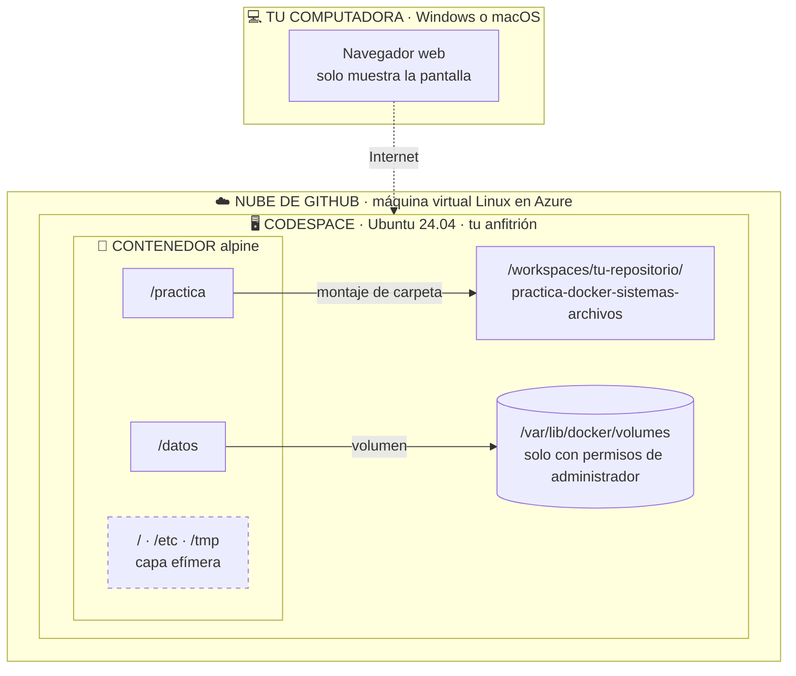

# Práctica alterna en GitHub Codespaces
## Contenedores, Docker CLI · «Un archivo, tres mundos»

| | |
|---|---|
| **Duración** | 60 minutos |
| **Modalidad** | Individual, desde cualquier computadora con navegador |
| **Herramientas** | Cuenta de GitHub + GitHub Codespaces (no se instala nada) |
| **Entregables** | Correo con bitácora `.log` y paquete `.zip` + hoja de respuestas |

---

## 1. ¿Para quién es esta versión?

Es la **alternativa oficial** a la práctica «Un archivo, tres mundos» para quienes **no pueden usar Docker Desktop** en su computadora, por ejemplo porque:

- su equipo **no permite la virtualización** (el procesador no la soporta o está desactivada y no se puede activar);
- su versión de Windows 10 no es compatible con Docker Desktop;
- su equipo no tiene memoria o espacio suficiente.

Se aprende **lo mismo**: distinguir los sistemas de archivos que conviven al usar Docker y practicar los comandos básicos de Linux. Lo único que cambia es **dónde corre Docker**: en lugar de tu computadora, en una máquina en la nube de GitHub que manejas desde el navegador.

> **Para qué te sirve:** administrar un servidor que no está físicamente frente a ti es exactamente lo que hace un administrador informático cuando trabaja con servidores en la nube.

---

## 2. Costos: esta práctica es gratuita

| Pregunta | Respuesta |
|---|---|
| ¿Tiene costo? | **No.** Se usa el plan gratuito de una cuenta personal de GitHub. |
| ¿Me piden tarjeta de crédito? | **No.** Se comprobó en una prueba real el 8 de octubre de 2026: crear el codespace no pidió tarjeta ni método de pago. |
| ¿Qué pasa si se me acaba la cuota gratuita? | Si tu cuenta **no tiene método de pago**, GitHub **bloquea** el uso hasta el siguiente mes. **No cobra.** |
| ¿Hay algo que deba evitar? | **No registres ninguna tarjeta** en GitHub. Así es imposible que se genere un cargo. |

---

## 3. Aviso sobre la cuota de uso

Tu cuenta gratuita incluye cada mes una **cuota de uso** de Codespaces. Así se calcula:

| Concepto | Cuota mensual gratuita | Qué significa para ti |
|---|---|---|
| **Tiempo de cómputo** | 120 horas | La máquina básica tiene 2 núcleos y descuenta el doble: rinde **unas 60 horas reales** al mes |
| **Almacenamiento** | 15 GB por mes | Un codespace guardado ocupa espacio aunque esté apagado |
| **Esta práctica** | Unas **2 horas** de la cuota (1 hora real × 2 núcleos) | Te sobra cuota de sobra |

### Cómo cuidar tu cuota

| Estado del codespace | Consume tiempo de cómputo | Consume almacenamiento |
|---|---|---|
| **Encendido** (*Active*) | Sí | Sí |
| **Detenido** (*Stopped*) | No | Sí |
| **Eliminado** | No | No |

- ⚠️ **Cerrar la pestaña del navegador no lo apaga.** Sigue encendido hasta que pasan **30 minutos** sin actividad.
- Al terminar: **1)** descarga tus evidencias, **2)** **detén** el codespace y **3)** **elimínalo** cuando hayas enviado tu correo. La sección 7.6 de la guía explica cada paso.
- Si olvidas eliminarlo, GitHub lo borra solo después de **30 días detenido**, pero mientras tanto ocupa almacenamiento.
- Opcional: en tu cuenta puedes acortar esos tiempos para que GitHub lo haga por ti (ver el Paso 5 de [`CUENTA_GITHUB.md`](CUENTA_GITHUB.md)).

---

## 4. ¿Qué cambia respecto a la práctica original?

Todo lo que aparece en esta tabla salió de una **prueba real** en Codespaces.

| Tema | Práctica original | Versión Codespaces |
|---|---|---|
| Dónde corre Docker | En una máquina virtual dentro de tu computadora | En una máquina virtual en la nube de GitHub (Microsoft Azure) |
| Carpeta de trabajo | Tu Escritorio | La carpeta de tu repositorio (`/workspaces/…`), visible en el explorador de VS Code |
| Identificador del equipo | `COMPUTERNAME` o `hostname` | `CODESPACE_NAME` |
| Editar desde «los dos mundos» | Bloc de notas o TextEdit | El editor de VS Code en el navegador |
| Prueba de mayúsculas | Linux: 2 archivos · tu sistema: 1 archivo | Todo es Linux, así que da 2 y 2; el contraste con tu Windows o macOS se hace con una prueba opcional en tu computadora |
| `ping` a Internet | Normalmente funciona | **Está bloqueado.** Se comprueba la conexión con HTTPS y se aprende por qué |
| Carpeta de volúmenes de Docker | No existe en tu sistema | Sí existe, pero solo el **administrador** puede verla (`sudo`) |
| Entrega | Correo con `.log` y `.zip` | Igual; antes descargas los dos archivos desde el navegador |

### Los tres mundos, ahora en la nube

---

## 5. Orden de trabajo

| Paso | Archivo | Tiempo |
|---|---|---|
| 1 | [`CUENTA_GITHUB.md`](CUENTA_GITHUB.md) · crear y asegurar tu cuenta de GitHub | 10 a 15 min, **antes** de la práctica |
| 2 | [`PRACTICA_CODESPACES.md`](PRACTICA_CODESPACES.md) · la práctica paso a paso | 60 min |
| 3 | [`HOJA_DE_RESPUESTAS_CODESPACES.md`](HOJA_DE_RESPUESTAS_CODESPACES.md) · las 12 preguntas | Al terminar cada sección |

**Requisitos:** una computadora con un navegador actualizado (Chrome, Edge o Firefox), conexión a Internet estable, tu número de cuenta y acceso a tu correo.

---

## 6. Entrega

### Por correo

| Campo | Qué escribir |
|---|---|
| **Para** | El correo que indique el profesor |
| **Asunto** | `[SO] Practica Docker FS | <numero de cuenta> | <Apellidos Nombre> | Codespaces` |
| **Adjunto 1** | `bitacora_<cuenta>.log` |
| **Adjunto 2** | `entrega_<cuenta>.zip` |
| **Cuerpo** | Nombre completo, número de cuenta, grupo y «Práctica realizada en GitHub Codespaces» |

### Hoja de respuestas

Escríbela a mano. Entrégala al profesor en el salón o, si te autorizó entregar a distancia, **escaneada en PDF** como tercer adjunto del correo.

### Lista de verificación

- [ ] La bitácora tiene registros de **S1 a S7**, tu número de cuenta y el identificador del codespace.
- [ ] La bitácora tiene menos de 300 líneas.
- [ ] El `.zip` lleva tu número de cuenta en el nombre.
- [ ] La huella SHA-256 de tu hoja coincide con la de la bitácora.
- [ ] Descargaste los dos archivos a tu computadora **antes** de eliminar el codespace.
- [ ] **Detuviste** el codespace y, después de enviar el correo, lo **eliminaste**. En https://github.com/codespaces ya no aparece.

---

## Anexo · Fuentes

**GitHub (documentación oficial)**
- Crear una cuenta: https://docs.github.com/en/get-started/start-your-journey/creating-an-account-on-github
- Verificar el correo: https://docs.github.com/en/account-and-profile/how-tos/email-preferences/verifying-your-email-address
- Autenticación de dos factores: https://docs.github.com/en/authentication/securing-your-account-with-two-factor-authentication-2fa/configuring-two-factor-authentication
- Cuota y facturación de Codespaces: https://docs.github.com/en/billing/concepts/product-billing/github-codespaces
- Tiempo de inactividad de un codespace: https://docs.github.com/en/codespaces/setting-your-user-preferences/setting-your-timeout-period-for-github-codespaces
- Detener e iniciar un codespace: https://docs.github.com/en/codespaces/developing-in-a-codespace/stopping-and-starting-a-codespace
- Eliminar un codespace: https://docs.github.com/en/codespaces/developing-in-a-codespace/deleting-a-codespace
- Eliminación automática de codespaces: https://docs.github.com/en/codespaces/setting-your-user-preferences/configuring-automatic-deletion-of-your-codespaces
- Cómo funciona un codespace por dentro: https://docs.github.com/en/codespaces/about-codespaces/deep-dive

**Docker y Linux**
- Almacenamiento en Docker (capa efímera, volúmenes y montajes): https://docs.docker.com/engine/storage/
- Retiro de Play with Docker y alternativas recomendadas por Docker: https://forums.docker.com/t/play-with-docker-is-deprecated-and-will-be-unavailable-starting-march-1-2026-learn-about-alternatives/151177
- Estándar de jerarquía de archivos de Linux (FHS 3.0): https://refspecs.linuxfoundation.org/FHS_3.0/fhs/index.html
- Comandos de BusyBox (los que trae Alpine): https://busybox.net/downloads/BusyBox.html
- Arpaci-Dusseau, R. H. y A. C. *Operating Systems: Three Easy Pieces*: https://pages.cs.wisc.edu/~remzi/OSTEP/
- Souppaya, M., Morello, J. y Scarfone, K. (2017). *Application Container Security Guide* (NIST SP 800-190): https://csrc.nist.gov/pubs/sp/800/190/final
