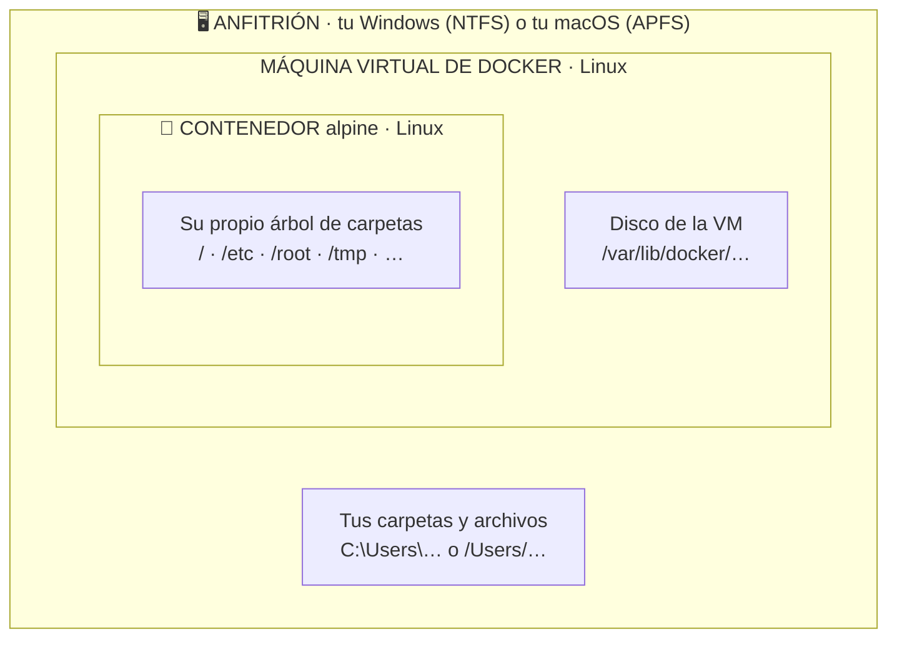
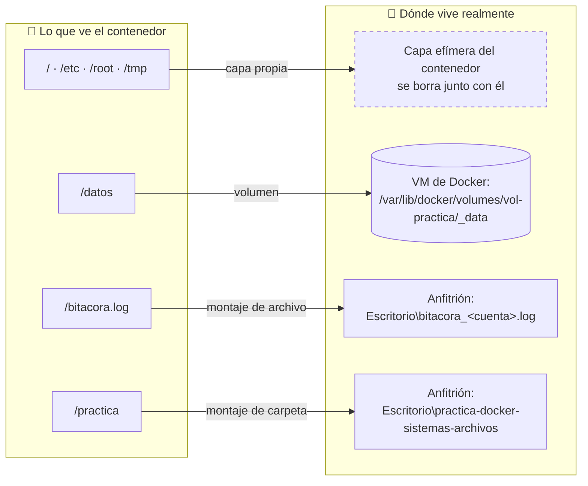

# Práctica: «Un archivo, tres mundos»
## Docker y los sistemas de archivos que conviven en tu computadora

| | |
|---|---|
| **Duración** | 60 minutos |
| **Modalidad** | Individual, en laboratorio o con equipo personal |
| **Herramientas** | Docker Desktop + terminal (PowerShell en Windows, Terminal en macOS) |
| **Entregables** | Hoja de respuestas en papel (en clase) + correo con bitácora `.log` y paquete `.zip` |

---

## 1. ¿Por qué esta práctica?

Hoy casi cualquier sistema administrativo —nómina, inventario, control escolar, facturación— termina ejecutándose en un **servidor Linux**, muchas veces dentro de **contenedores**. Sin embargo, la computadora desde la que tú lo administras probablemente usa Windows o macOS.

Cuando trabajas con Docker en tu equipo, en realidad conviven **tres sistemas de archivos distintos**, cada uno con sus propias reglas y su propia forma de nombrar las cosas. Un administrador informático que no distingue estos tres «mundos» comete errores caros:

- Guarda la base de datos donde se **borra** al apagar el contenedor.
- Busca un archivo con una ruta de Windows dentro de un servidor Linux y «no existe».
- Copia `Logo.png` y `logo.png` a la misma carpeta de Windows y **pierde uno sin darse cuenta**.
- No sabe qué carpeta debe incluir en el **respaldo**.

**Para qué te sirve:** al terminar sabrás responder con seguridad la pregunta que todo responsable de TI debe poder contestar: *«¿Dónde vive realmente este archivo, quién puede verlo y qué pasa con él si apago o borro el contenedor?»*

---

## 2. Objetivos de aprendizaje

Al terminar la práctica podrás:

1. **Distinguir** los tres sistemas de archivos que intervienen al usar Docker: el del sistema operativo anfitrión, el de la máquina virtual de Docker y el del contenedor.
2. **Traducir** una misma carpeta entre la nomenclatura de tu sistema (`C:\Users\…` o `/Users/…`) y la de Linux (`/practica`).
3. **Usar la línea de comandos de Linux** sin interfaz gráfica:
   - Navegación y directorios: `pwd`, `ls` (con banderas `-l`, `-a`, `-h`, `-R`), `cd`
   - Gestión de archivos: `mkdir`, `cp`, `mv`, `rm`
   - Análisis y lectura de datos: `cat`, `less`, `grep`, `wc`
   - Control del sistema y redes: `df`, `top`, `ping`
4. **Crear, navegar, escribir y editar** una estructura de carpetas y archivos.
5. **Documentar** tu trabajo en una bitácora breve y verificable, como se hace en un entorno profesional.

---

## 3. Conceptos mínimos (lee esto antes de empezar · 3 min)

| Término | Explicación sencilla | Analogía administrativa |
|---|---|---|
| **Anfitrión** (*host*) | Tu computadora y su sistema operativo (Windows o macOS). | El edificio de la empresa. |
| **Máquina virtual de Docker** | Una pequeña computadora Linux «simulada» que Docker Desktop arranca en segundo plano, porque los contenedores Linux necesitan un núcleo (*kernel*) Linux. | Un piso rentado dentro del edificio, con sus propias reglas. |
| **Imagen** | Plantilla de solo lectura con un sistema mínimo y sus programas (aquí: `alpine:3.21`). | El formato oficial de un expediente en blanco. |
| **Contenedor** | Una ejecución aislada creada a partir de una imagen. Tiene su propio árbol de carpetas. | Una oficina temporal armada con ese formato. |
| **Capa efímera** | Lo que el contenedor escribe en su propio disco. **Se pierde** al borrar el contenedor. | Notas en un pizarrón que se borra al cerrar la oficina. |
| **Montaje de carpeta** (*bind mount*) | Una carpeta de tu computadora que se «asoma» dentro del contenedor con otro nombre. | Una ventanilla que conecta la oficina temporal con el archivo del edificio. |
| **Volumen** | Almacenamiento que administra Docker dentro de su máquina virtual. **Sobrevive** aunque se borre el contenedor. | Una bodega del piso rentado. |

### Los tres mundos en dos diagramas

**1. Cómo se acomodan.** Cada mundo vive dentro del anterior:



**2. Dónde vive realmente cada cosa.** El contenedor ve rutas Linux, pero los datos están en lugares distintos:



Lo que está en el recuadro punteado no vive en ningún otro lugar: desaparece al borrar el contenedor.

### Nomenclatura comparada

| Característica | Windows (anfitrión) | macOS (anfitrión) | Contenedor Linux |
|---|---|---|---|
| Separador de carpetas | `\` (diagonal invertida) | `/` | `/` |
| Raíz | Una por unidad: `C:\`, `D:\` | Una sola: `/` | Una sola: `/` |
| Carpeta del usuario | `C:\Users\ana` | `/Users/ana` | `/root` (usuario administrador) |
| ¿`Nota.txt` y `nota.txt` son distintos? | No (NTFS no distingue mayúsculas) | No, por omisión (APFS) | **Sí** (distingue mayúsculas) |
| Archivos ocultos | Atributo «oculto» | Nombre inicia con `.` | Nombre inicia con `.` |
| Ejemplo de la misma carpeta | `C:\Users\ana\Desktop\practica-docker-sistemas-archivos` | `/Users/ana/Desktop/practica-docker-sistemas-archivos` | `/practica` |

---

## 4. Requisitos previos (antes de la clase)

1. **Docker Desktop instalado y abierto** (el ícono de la ballena debe estar quieto, no animado).
2. En Windows: Docker en modo **Linux containers** (es el modo por omisión).
3. Descargar la imagen con anticipación para no saturar la red del laboratorio:
   ```
   docker run --rm alpine:3.21 echo listo
   ```
   Si aparece `listo`, todo está preparado.
4. Tener a la mano tu **número de cuenta** y tu **nombre completo**.
5. Acceso a tu **correo institucional** para la entrega.

> No necesitas permisos de administrador. **No** abras la terminal «como administrador».

---

## 5. ¿Qué guía sigo?

| Tu sistema operativo | Archivo que debes abrir | Terminal |
|---|---|---|
| Windows 10 u 11 (español o inglés) | [`PRACTICA_WINDOWS.md`](PRACTICA_WINDOWS.md) | Windows PowerShell o Terminal de Windows |
| macOS (Intel o Apple Silicon) | [`PRACTICA_MACOS.md`](PRACTICA_MACOS.md) | Terminal |
| Linux (Ubuntu, Fedora, etc.) | [`PRACTICA_MACOS.md`](PRACTICA_MACOS.md) + recuadros «Si usas Linux» | Terminal |

Además:

- [`HOJA_DE_RESPUESTAS.md`](HOJA_DE_RESPUESTAS.md) — las 12 preguntas que entregarás **en papel** al final de la clase.
- [`GUIA_DOCENTE.md`](GUIA_DOCENTE.md) — solo para el profesor (preparación, respuestas esperadas y verificación).

---

## 6. Mapa de la sesión (60 min)

| # | Sección | Dónde trabajas | Comandos clave | Tiempo | Preguntas de la hoja |
|---|---|---|---|---|---|
| 1 | Identidad, carpeta y bitácora | 🖥️ Anfitrión | variables de entorno, `cd`, `mkdir` | 8 min | 1 y 2 |
| 2 | Tres mundos, tres nombres | 🖥️ Anfitrión → Docker | `docker version`, `docker info`, `docker volume` | 8 min | 3, 4 y 5 |
| 3 | Entrar al contenedor y navegar | 🐧 Contenedor | `pwd`, `ls -l -a -h -R`, `cd` | 8 min | 6 |
| 4 | Construir y editar | 🐧 Contenedor + 🖥️ editor | `mkdir -p`, `cp`, `mv`, `rm`, `sed`, `vi` | 12 min | 7 y 8 |
| 5 | Analizar datos | 🐧 Contenedor | `cat`, `less`, `grep`, `wc` | 8 min | 9 y 10 |
| 6 | Sistema y red | 🐧 Contenedor | `df`, `top`, `ping` | 6 min | 11 y 12 |
| 7 | Cierre, empaquetado y entrega | 🖥️ Anfitrión | `zip` / `Compress-Archive`, huella SHA-256 | 6 min | — |
| | Margen para dudas | | | 4 min | |

Responde cada pregunta **en tu hoja en cuanto termines la sección correspondiente**; no las dejes para el final.

---

## 7. Reglas de trabajo

**Idempotencia.** Todos los pasos están escritos para que puedas **repetirlos sin romper nada**: si una carpeta ya existe, no marca error; si un archivo ya existe, se reemplaza. Si algo sale mal o cerraste la ventana, vuelve a ejecutar el bloque de preparación y continúa desde donde ibas. *Por qué importa:* en administración real los procesos se interrumpen (cortes de luz, red, errores humanos) y un procedimiento que se puede reintentar con seguridad vale oro.

**Bitácora corta y controlada.** Cada registro guarda solo las primeras líneas de la salida (entre 1 y 25). En pantalla ves todo; en la bitácora queda solo la evidencia necesaria. Al final debe medir **menos de 300 líneas**. *Por qué importa:* una bitácora que nadie puede leer no sirve como evidencia.

**¿Dónde estoy?** Fíjate siempre en el inicio de la línea (*prompt*):

| Ves algo como… | Estás en… | Escribes comandos de… |
|---|---|---|
| `PS C:\Users\ana\...>` | 🖥️ Anfitrión Windows | PowerShell |
| `ana@MacBook ~ %` o `$` | 🖥️ Anfitrión macOS / Linux | zsh / bash |
| `/practica #` | 🐧 Contenedor | Linux (sh) |

**Copiar y pegar.** Copia cada bloque completo, pégalo y presiona Enter. Lee la salida antes de seguir: entender lo que pasó es el objetivo, no solo terminar.

---

## 8. Qué debe existir al terminar

```
Escritorio/
├── bitacora_<cuenta>.log                ← tu bitácora (evidencia principal)
├── entrega_<cuenta>.zip                 ← paquete para el correo
└── practica-docker-sistemas-archivos/
    ├── caso/                            ← prueba de mayúsculas en el anfitrión
    ├── datos/
    │   ├── entrada/inventario.csv
    │   └── salida/{reporte.txt, en_mantenimiento.csv}
    ├── docs/notas.txt                   ← editado desde el contenedor y desde tu sistema
    ├── respaldo/notas_respaldo.txt
    └── salidas/{estructura_final.txt, bitacora_<cuenta>.log}
```

---

## 9. Entrega

### 9.1 En papel, al final de la clase

1. Usa una hoja tamaño carta (blanca o cuadriculada) o imprime `HOJA_DE_RESPUESTAS.md`.
2. Llena el encabezado completo, **incluido el identificador de tu equipo** y los **primeros 8 caracteres de la huella SHA-256** de tu `.zip` (ambos aparecen en tu bitácora).
3. Responde las **12 preguntas** con tus palabras, de 2 a 4 renglones cada una.
4. Firma y entrega la hoja al profesor **antes de salir del salón**.

### 9.2 Por correo, el mismo día de la clase

| Campo | Qué escribir |
|---|---|
| **Para** | `______________________@uaemex.mx` *(el profesor lo indicará)* |
| **Asunto** | `[SO] Practica Docker FS | <numero de cuenta> | <Apellidos Nombre>` |
| **Adjunto 1** | `bitacora_<cuenta>.log` (está en tu Escritorio) |
| **Adjunto 2** | `entrega_<cuenta>.zip` (está en tu Escritorio) |
| **Cuerpo** | Nombre completo, número de cuenta, grupo y sistema operativo que usaste. |

> **Los dos adjuntos son obligatorios.** La bitácora prueba *qué* ejecutaste y *cuándo*; el `.zip` prueba que los archivos realmente se crearon. Uno sin el otro no permite verificar la práctica.
> Si tu correo rechaza el `.zip`, súbelo a tu OneDrive institucional y envía el enlace, pero adjunta de todos modos el `.log`.

### 9.3 Lista de verificación antes de enviar

- [ ] La bitácora contiene registros de **S1 a S7** y tu número de cuenta.
- [ ] La bitácora tiene menos de 300 líneas.
- [ ] El `.zip` lleva tu número de cuenta en el nombre.
- [ ] La huella SHA-256 anotada en tu hoja coincide con la de la bitácora.
- [ ] El asunto del correo sigue el formato indicado.

---

## 10. Evaluación

| Criterio | Evidencia | Peso |
|---|---|---|
| Ejecución completa y verificable | Bitácora con S1–S7, identidad y equipo coherentes | 35 % |
| Productos generados | `.zip` con la estructura y archivos esperados | 20 % |
| Comprensión conceptual | Hoja de respuestas (12 preguntas) | 40 % |
| Formato de entrega | Asunto, nombres de archivo, puntualidad | 5 % |

---

## Anexo A · Fuentes confiables y de rigor académico

**Sistemas operativos y sistemas de archivos (académicas)**

- Arpaci-Dusseau, R. H. y Arpaci-Dusseau, A. C. *Operating Systems: Three Easy Pieces*. Capítulo «Files and Directories». Universidad de Wisconsin–Madison. https://pages.cs.wisc.edu/~remzi/OSTEP/file-intro.pdf
- Libro completo (gratuito): https://pages.cs.wisc.edu/~remzi/OSTEP/
- Felter, W., Ferreira, A., Rajamony, R. y Rubio, J. (2015). *An updated performance comparison of virtual machines and Linux containers*. IEEE ISPASS. https://doi.org/10.1109/ISPASS.2015.7095802
- Merkel, D. (2014). *Docker: lightweight Linux containers for consistent development and deployment*. Linux Journal, 239. https://dl.acm.org/doi/10.5555/2600239.2600241
- Souppaya, M., Morello, J. y Scarfone, K. (2017). *Application Container Security Guide* (NIST SP 800-190). https://csrc.nist.gov/pubs/sp/800/190/final

**Estándares y manuales de Linux**

- Linux Foundation. *Filesystem Hierarchy Standard 3.0* (estructura de `/etc`, `/var`, `/tmp`, etc.). https://refspecs.linuxfoundation.org/FHS_3.0/fhs/index.html
- Páginas de manual de Linux (`man`) mantenidas por Michael Kerrisk. https://man7.org/linux/man-pages/
- Espacios de nombres de montaje (cómo un contenedor «ve» su propio árbol de archivos). https://man7.org/linux/man-pages/man7/mount_namespaces.7.html
- GNU Coreutils (`ls`, `cp`, `mv`, `rm`, `mkdir`, `cat`, `wc`, `df`). https://www.gnu.org/software/coreutils/manual/coreutils.html
- GNU Grep. https://www.gnu.org/software/grep/manual/grep.html
- BusyBox (versiones compactas de los comandos que trae Alpine). https://busybox.net/downloads/BusyBox.html
- Shotts, W. *The Linux Command Line* (libro libre). https://linuxcommand.org/tlcl.php

**Documentación oficial de Docker**

- Almacenamiento: capa efímera, volúmenes y montajes. https://docs.docker.com/engine/storage/
- Volúmenes. https://docs.docker.com/engine/storage/volumes/
- Montajes de carpeta (*bind mounts*). https://docs.docker.com/engine/storage/bind-mounts/
- Controlador OverlayFS (cómo se apilan las capas). https://docs.docker.com/engine/storage/drivers/overlayfs-driver/
- Docker Desktop con WSL 2 en Windows. https://docs.docker.com/desktop/features/wsl/
- Administrador de máquinas virtuales de Docker Desktop en Mac. https://docs.docker.com/desktop/features/vmm/
- Instalación en Windows. https://docs.docker.com/desktop/setup/install/windows-install/
- Instalación en Mac. https://docs.docker.com/desktop/setup/install/mac-install/
- Imagen oficial de Alpine Linux. https://hub.docker.com/_/alpine

**Documentación oficial de Microsoft y Apple**

- `Environment.GetFolderPath` (ruta real del Escritorio). https://learn.microsoft.com/en-us/dotnet/api/system.environment.getfolderpath
- Variables de entorno en PowerShell. https://learn.microsoft.com/en-us/powershell/module/microsoft.powershell.core/about/about_environment_variables
- Sensibilidad a mayúsculas entre Windows y Linux. https://learn.microsoft.com/en-us/windows/wsl/case-sensitivity
- Trabajo con archivos entre Windows y Linux (WSL). https://learn.microsoft.com/en-us/windows/wsl/filesystems
- `Compress-Archive`. https://learn.microsoft.com/en-us/powershell/module/microsoft.powershell.archive/compress-archive
- `Get-FileHash`. https://learn.microsoft.com/en-us/powershell/module/microsoft.powershell.utility/get-filehash
- Apple: formatos de sistema de archivos (APFS y distinción de mayúsculas). https://support.apple.com/guide/disk-utility/file-system-formats-dsku19ed921c/mac
